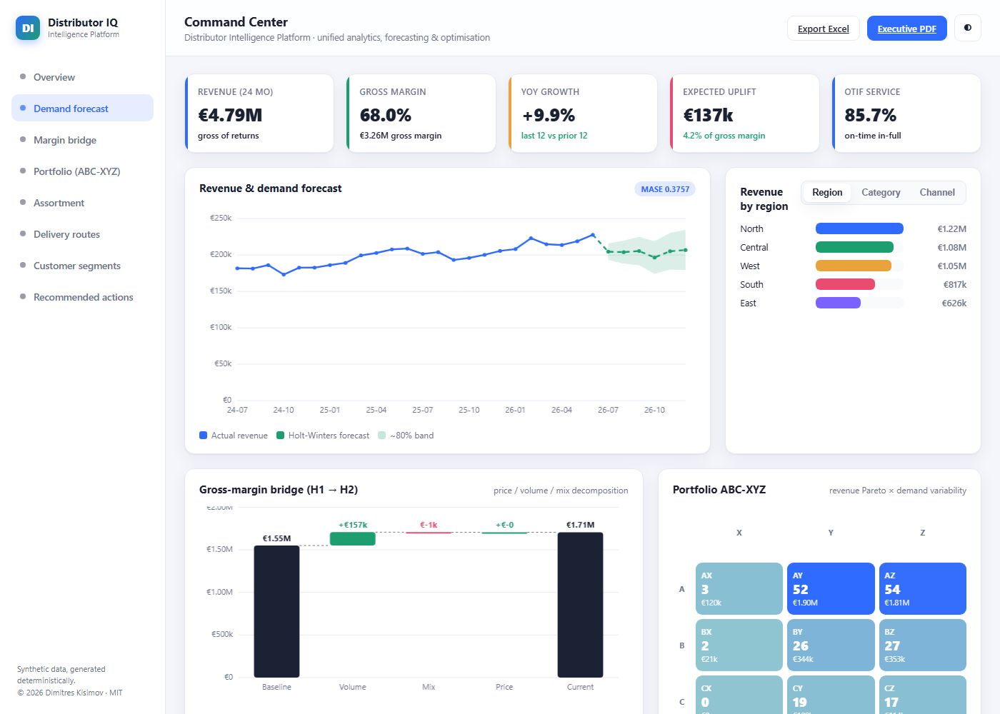

# Distributor Intelligence Platform

I built this to answer a question I kept running into: a mid-size industrial
distributor sits on a mountain of transactional data — every SKU, every
delivery, every month of demand — and yet the people who set prices, choose
what to stock, and plan the vans are usually working off gut feel and last
quarter's spreadsheet. This platform is my attempt at the MRO command center
those decisions deserve: one place where the descriptive numbers, the forecast,
and the actual optimisation of price / assortment / routing all live behind a
single API and a single dashboard.



*Captured from a fresh local run (`python app.py`, synthetic seeded data).*

Three headline numbers, straight from the engines on the seeded synthetic
dataset (full table and caveats below): forecast **MASE 0.38** over 9 rolling
folds, **25.0% routing km saved** vs the nearest-neighbour baseline, and an
expected annual uplift of **EUR 136,972** (8.4% of annual gross margin) —
modelled on synthetic data, not a real-world claim.

Everything runs on a **synthetic, deterministic dataset** (seeded NumPy, built
in `dip/data.py`) — roughly 200 SKUs across 8 categories, 52 delivery
customers, and 24 months of demand history. It represents no real company. That
choice is deliberate: it means the dashboard, the exported PDF, and the test
suite all agree on the same numbers on any machine, and I can quote figures
below that you can reproduce exactly by running the code.

## What it does

Four things, layered:

1. **Describe** — headline KPIs, revenue breakdowns (region / category /
   channel), an ABC-XYZ inventory classification, RFM customer segmentation,
   a price/volume/mix gross-margin bridge, and cross-sell association rules
   mined from the order baskets. The ABC-XYZ cells and RFM segment bars drill
   down to the underlying SKU and customer tables, so "CZ is dead weight"
   resolves to actual SKU names and "call the at-risk accounts" to actual
   customers — and the Revenue and Gross-margin KPI tiles drill down to
   revenue-by-segment and margin-by-category tables that sum back to the
   headline exactly.
2. **Forecast** — monthly revenue projected six months out with an additive
   Holt-Winters model, with the error *earned* through a rolling-origin
   backtest rather than asserted.
3. **Optimise** — three prescriptive engines, each shipped next to a fair
   baseline so the lift is always quantified: a MILP assortment (vs a greedy
   density heuristic), elasticity-based pricing (vs status quo), and an
   OR-Tools CVRP for the delivery run (vs nearest-neighbour construction).
4. **Prescribe** — the composition layer that rolls the three lifts into one
   expected annual € uplift and a set of ranked "recommended action" cards, and
   emits an executive PDF and Excel workbook from the exact same plan. The
   dashboard can pin the plan on screen and compare it against any other
   budget/guardrail scenario side by side with a modelled uplift delta
   (routing is solved once at startup and is identical in both scenarios, so
   the delta comes from pricing and assortment — the compare strip says so).

## The numbers it currently produces

These come straight out of the engines on the seeded dataset — run
`python -m dip --deliverables` or the module `__main__` blocks and you'll get
the same values:

| Metric | Value |
| --- | --- |
| Revenue (24 months) | EUR 4,788,971 |
| Gross margin | EUR 3,257,507 (68.0%) |
| YoY revenue growth | +9.9% |
| OTIF service level (modelled) | 85.7% |
| Forecast accuracy | MASE 0.38 over 9 rolling folds (Holt-Winters additive) |
| Next-month revenue forecast | EUR 204,618 |
| Assortment: MILP vs greedy | EUR 935,527 vs EUR 934,503 margin (+EUR 1,024) on 108 SKUs under a EUR 10,558 working-capital budget |
| Pricing uplift | +EUR 95,609 (+6.4% of gross profit) |
| Routing | 420 km vs 560 km baseline — 140 km / 25.0% saved per run, 6 vehicles |
| **Expected annual uplift** | **EUR 136,972 (8.4% of annual gross margin)** |

A note of honesty on those: the assortment MILP only edges out the greedy
heuristic by ~EUR 1k here — knapsack-style problems with this cost structure
are ones greedy already solves nearly optimally, and I'd rather show that than
pretend the gap is huge. The MASE below 1.0 means the model beats a
seasonal-naive benchmark on this seeded series; it is not a claim about real
demand. The routing saving is a single day's run annualised over an assumed 250
runs at EUR 1.15/km. The CVRP search terminates on a fixed solution budget
rather than a wall-clock limit, so the 140 km figure — and every number built
on it, including the EUR 136,972 headline — is identical on every solve; an
earlier build used a 3-second time limit, which let the same process quote two
different km depending on machine load.

## Use your own data (Excel round-trip)

The demo doesn't have to stay a demo. The dashboard's **Template** button (or
`GET /api/import/template`) serves an empty workbook with an `Instructions`
sheet and a `SKUs` sheet — one row per product in wide format:

```
sku | name | category | unit_cost | unit_price | 2024-07 | 2024-08 | ... | 2026-06
```

The 24 month columns hold units sold per month (blank = 0). Fill it in, hit
**Import Excel** (or `POST /api/import`, multipart field `workbook`), and the
*whole* platform — KPIs, forecast, ABC-XYZ, margin bridge, assortment MILP,
pricing, the prescription plan and both exports — re-runs on your data through
the exact same single-plan path the synthetic mode uses. A banner shows
"Your data: *file.xlsx* (N SKUs)" with a reset button; the Excel you then
export quotes your numbers, closing the loop (there's a test that traces
imported values through the KPIs into the exported Summary sheet).

Validation is strict and cell-addressed (`SKUs!D5: unit_cost must be a
number...`): missing sheet or renamed/extra columns, non-numeric or negative
values, zero prices, duplicate SKUs, files over 2 MB or 2,000 rows are all
rejected with the offending cells listed — and a failed import leaves the
running state untouched.

Honesty notes, because an import is only as good as its assumptions (they are
disclosed in the import response, the explanation caveats, and the template
itself):

- **Customers and delivery routing stay synthetic.** The template covers
  products only, so the RFM view and the CVRP run keep the seeded demo layer
  (and reuse the startup routing solve) — labelled as such, never blended in
  silently.
- **Elasticities are category defaults** (matched against the eight known
  category names, else -1.2), lead time is assumed 10 days and shelf space 1.0
  per SKU. Pricing recommendations on imported data are directional, not
  gospel.
- **Nothing is persisted.** The imported dataset lives in process memory only;
  `POST /api/reset` (or a restart) returns the app to the synthetic dataset —
  the exact startup objects, so post-reset responses are byte-identical to a
  fresh boot (also tested).

## Why this plan?

Every plan can explain itself. `GET /api/explain` (surfaced as a collapsible
**"Why this plan?"** panel on the dashboard, a fifth **Why this plan?** page in
the executive PDF, and an **Explanation** sheet in the exported workbook — all
rendered from the same structure, one source of truth) answers four questions:

1. **Which constraints bind?** Working-capital budget utilisation (and how many
   SKUs the budget forces out of the assortment) and how many price
   recommendations are clipped at the ±guardrail.
2. **What changes vs doing nothing?** Per lever, the top 5 SKU-level moves with
   their individual EUR contributions plus the remainder — moves + remainder
   sum exactly to the lever total (tested).
3. **How sensitive is the number?** The same deterministic plan path re-run at
   budget −10% and +10% (two extra solves that reuse the one routing solve).
   Fine print: the assortment lever is the optimiser's edge *over the greedy
   baseline at the same budget*, so a looser budget can shrink the edge even
   though it captures more absolute margin — the explanation says so instead
   of hiding it.
4. **What should you not over-trust?** Auto-included caveats: the data source
   (synthetic vs your imported file), the constant-elasticity pricing
   assumption, and the routing solved-once note.

## Cross-sell: what sells together

`GET /api/crosssell` (a **Cross-sell** card on the dashboard, a `Cross-sell`
sheet in the exported workbook) mines association rules over the platform's
order baskets with a from-scratch Apriori engine adapted by copy from my
`market-basket-analysis` project — the same dependency-by-copy pattern used
elsewhere, so this repo stays self-contained.
One basket per synthetic customer order event (the exact order months the RFM
history already counts), built deterministically in `dip/data.py` as part of
the *one* seeded dataset — the basket draws are appended to the end of the rng
stream, so every number quoted above is byte-identical to builds that predate
the feature (pinned by a regression test).

`GET /api/crosssell?product=SKU-0086&top=5` returns the top-N cross-sell
recommendations for one product; every rule ships with its **support**
(share of baskets containing both SKUs), **confidence** (share of the
antecedent's baskets that also contain the consequent), **lift**
(confidence vs the consequent's baseline rate) and the absolute basket count
behind it.

Honesty notes (they ride on the API payload, the dashboard card and the
workbook sheet):

- **All of it is computed on the seeded synthetic demo data.** No real
  purchasing behaviour is involved; the mined structure is the region/demand
  affinity the generator itself puts into the baskets.
- **Lift is co-occurrence, not causation.** A lift of 4 means the pair shares
  baskets four times more often than independence would predict *in this
  history* — it is not a promise of sales uplift, and a campaign built on a
  rule would still need an A/B test.
- Rules backed by fewer baskets than the stability threshold are kept but
  flagged **`thin_support`** (and badged on the dashboard) instead of being
  quietly presented as solid.
- **Excel imports carry no order-line data** (the template covers products
  and monthly units only), so cross-sell reports itself unavailable on
  imported datasets rather than inventing baskets for them.

## KPI drill-downs

The **Revenue** and **Gross margin** headline tiles click open to
`GET /api/kpis/drilldown`: revenue by (region × channel) segment and gross
margin by category (revenue, COGS, margin, margin %, share). The rows
partition the same monthly ledger the KPI tiles are computed from, so each
drill-down sums to its headline **to the cent** — asserted by tests, on
screen and in the workbook's `Drill-downs` sheet alike.

## Running it

```bash
pip install -r requirements.txt

# 1) the dashboard
python app.py                 # -> http://localhost:5000
#    (or: python -m dip)

# 2) the executive deliverables
python -m dip --deliverables  # writes deliverables/executive_review.pdf + .xlsx

# 3) containerised
docker compose up             # serves on http://localhost:5000 via gunicorn
```

Tests and lint:

```bash
python -m ruff check .
python -m pytest -q
```

### Optional API token

By default the app runs as an open local demo. Setting `DIP_API_TOKEN` makes
every `/api/*` route require `Authorization: Bearer <token>` (401 otherwise);
the HTML pages stay open. This is a deployment stub, not production auth —
one shared token, no users, no scopes, no rotation. A real deployment needs a
proper identity provider (OIDC/OAuth2) in front of the app.

```bash
DIP_API_TOKEN=changeme python app.py
curl -H "Authorization: Bearer changeme" http://localhost:5000/api/health
```

## Architecture

```
dip/data.py        one seeded synthetic dataset (single source of truth)
dip/importer.py    Excel template + validated import of the user's own SKUs
   |
dip/analytics.py   KPIs (+ drill-downs), breakdowns, ABC-XYZ, RFM, margin bridge
dip/crosssell.py   Apriori cross-sell rules (adapted from market-basket-analysis)
dip/forecast.py    Holt-Winters + rolling-origin MASE backtest
dip/optimize.py    assortment MILP / elasticity pricing / OR-Tools CVRP
dip/prescribe.py   composes the lifts into one plan + action cards
dip/explain.py     "why this plan?" — binding constraints, moves, sensitivity
dip/exports.py     PDF (matplotlib) and Excel (openpyxl) from that plan
   |
app.py             Flask: engines cached per dataset (synthetic or imported)
   |
templates/, static/  the executive command-center dashboard (hand-built charts)
```

The Flask layer runs every expensive computation once per dataset and caches
it, so the dashboard stays snappy; only the parameterised optimisers
(assortment budget, price guardrail) compute per request. Routing and pricing
are solved exactly once per dataset, the prescription plan is composed *from*
those cached results, and the `/api/explain` endpoint, the PDF/Excel endpoints
and the `--deliverables` CLI reuse the same plan object — the routes view, the
action cards, the explanation and the exports cannot quote different numbers
for the same scenario, in synthetic *and* in imported mode (tested both ways).

## Synthetic data & limitations

- **All data is synthetic and deterministic.** It models no real distributor,
  customer, or transaction, and there is no external dataset dependency.
- The figures above are *as-measured on this seed* — they are illustrative of
  the method, not a benchmark against real-world data or a claim of
  state-of-the-art performance.
- OTIF is a modelled proxy from lead-time reliability, not observed service
  data. The margin bridge's price term is a residual (prices are static in the
  synthetic world) and is reported as such rather than fabricated.
- The routing saving annualises one representative delivery run; real fleets
  vary day to day.

## Author & licence

Dimitres Kisimov, 2026. © 2026 Dimitres Kisimov — all rights reserved; published for portfolio review. See LICENSE. See `CREDITS.md` for the open-source
components and `docs/BUSINESS_CASE.md` for the business framing.
